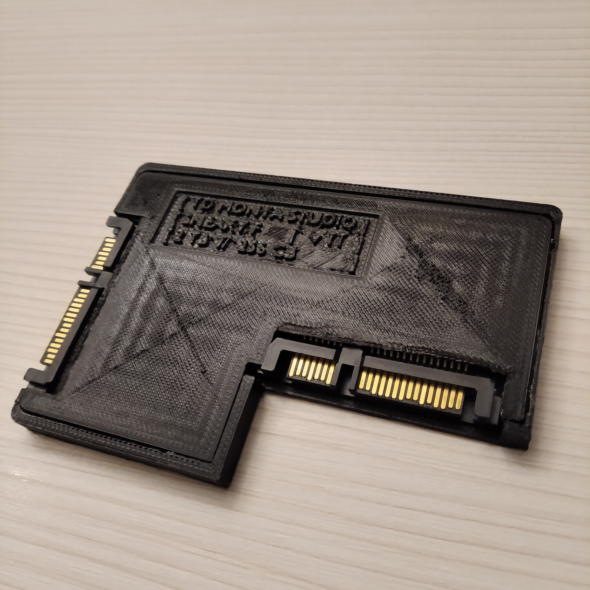
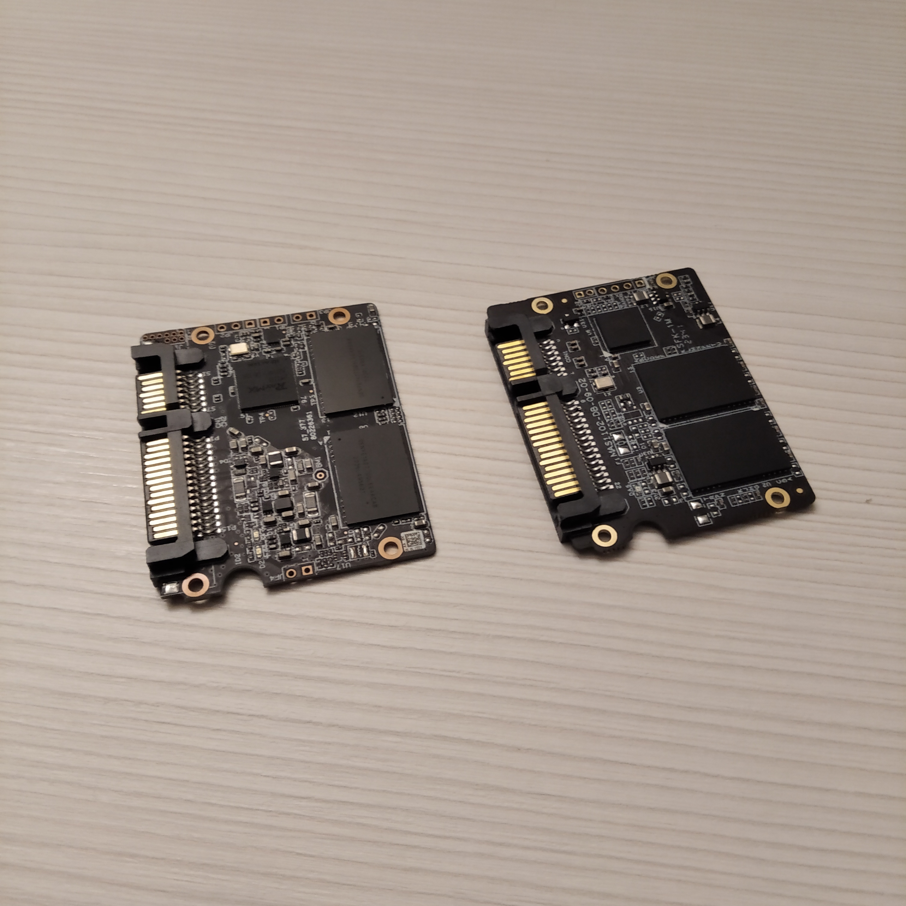
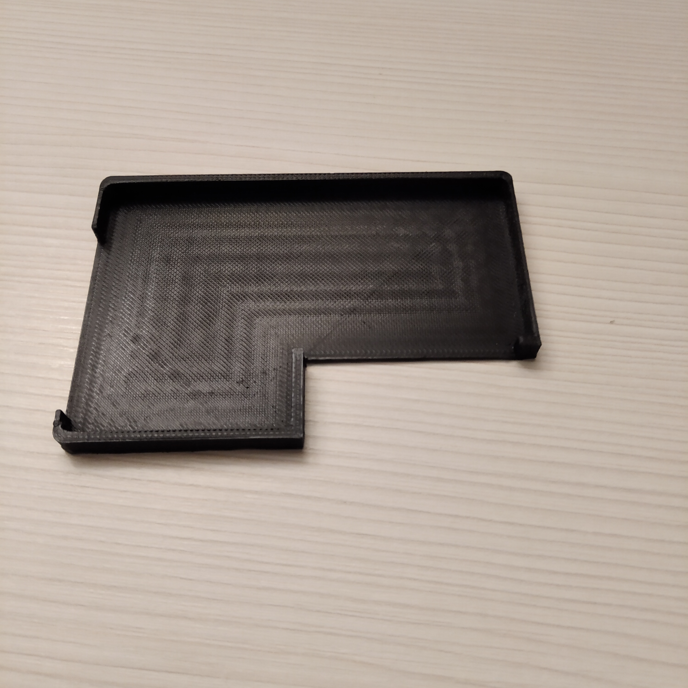
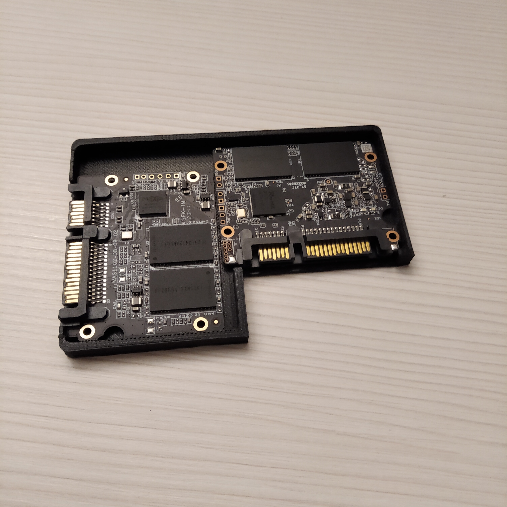
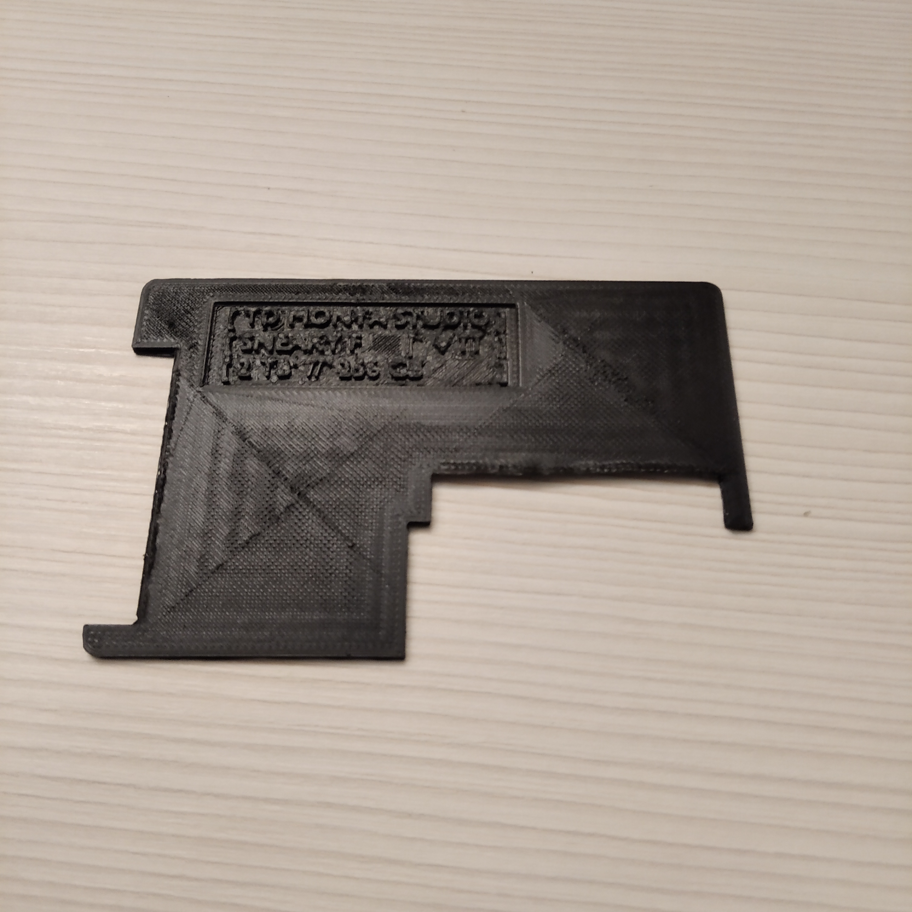
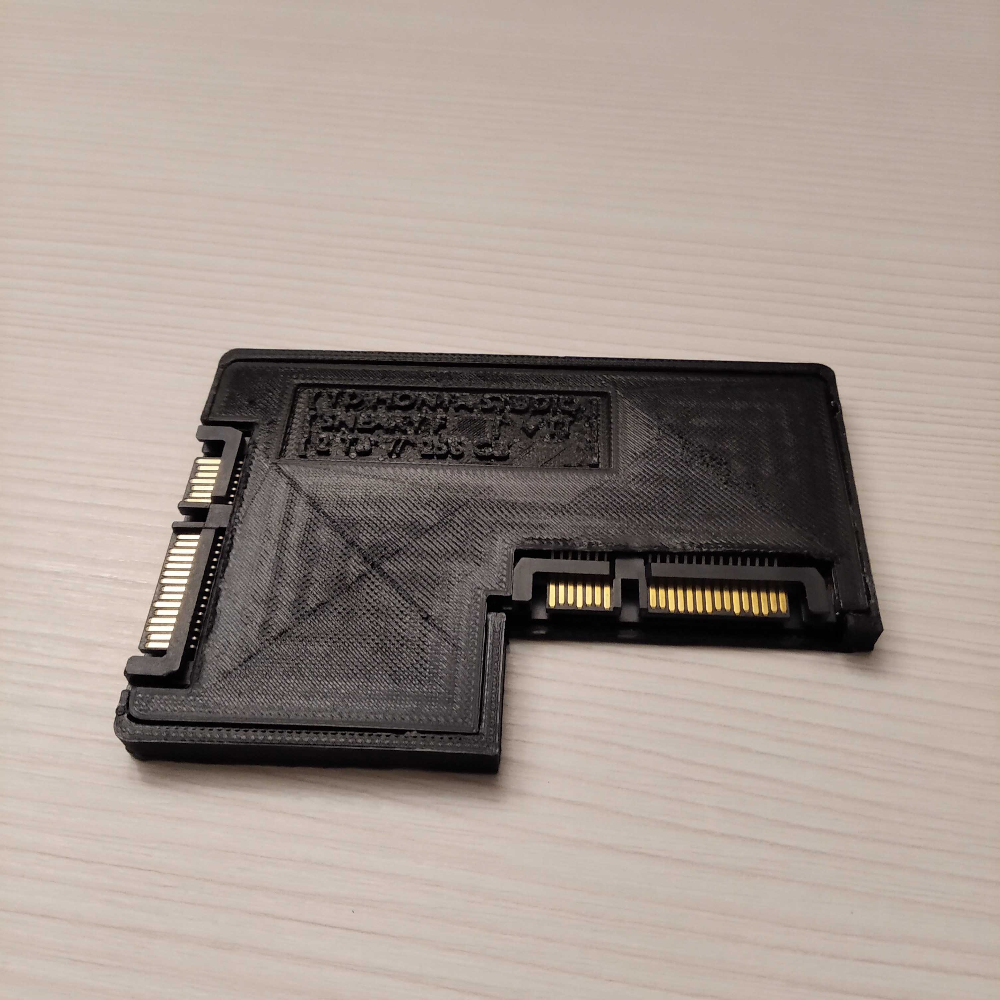
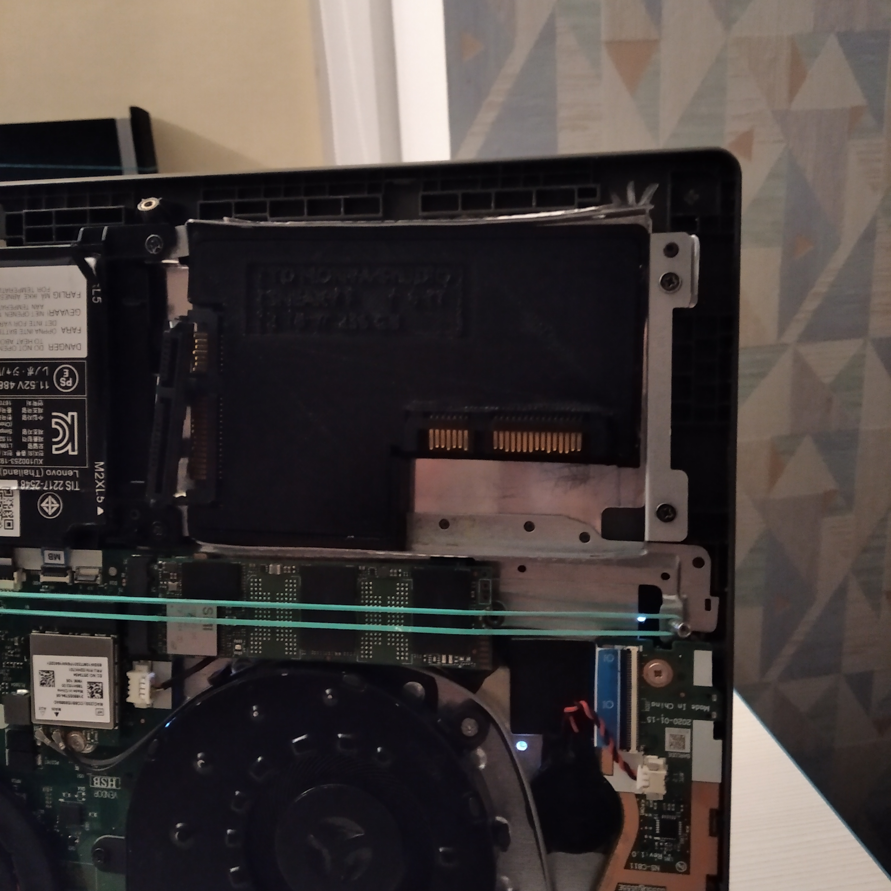
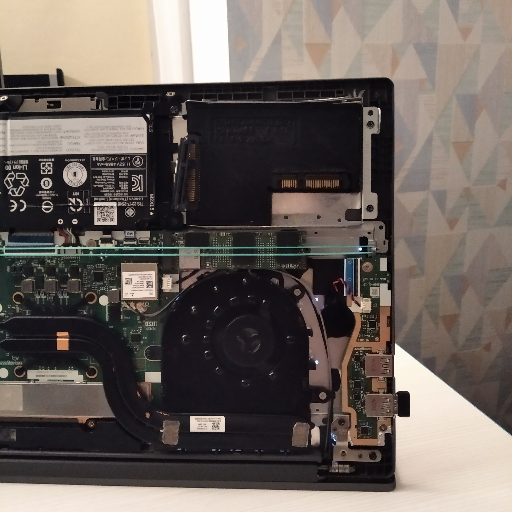

# DUAL SSD "SNEAKY F"

**проект створений для навчальних цілей, але ідея цікава**

## 🤨 Навіщо ?:
для того щоб отримати 2 фізично різних SSD диска в одному слоті для еконмії місця.

## 🤓 Опис:
Новітня розробка диска лінійки "SNEAKY F" вирішує головну проблему сучасності - "спрощення і зменшення техніки".
він займає лише ОДИН стандартний слот 2.5 SATA SSD а всередині себе має ДВА незалежних SATA SSD і ДВА окремих підключення.
також це ідеальне рішення для аматорських СЕРВЕРІВ саме через те що "SNEAKY F" має кутове розташування SATA портів, що робить його зручним для розташування в кутах корпусу і складання в стопку один на одного.
також верхня кришка знімається легко - для того щоб можна було поставити потужні радіатори на NAND чіпи. отак от. се є крута річ.

## ☠️ Використані технології:
- CAD проектування в BLENDER
- слайсинг в ULTIMAKER CURA
- FDM друк на 3D принтері

## 🌱 Структура проекта:
- `STL_files/` — STL файли (3D модельки)
- `GCODE_files/anycubic_vyper` - GCODE файли (інструкції для 3D принтера)
- `photo/` — фоточки проекта

## 😎 Як це зібрати ?:
тобто "документація" по збіркі одразу тут нижче. удачі...

## 1. SSD плати:
1. беремо дві SSD плати (в мене це розібраний FANXIANG SSD)

## 2. Основа
друкуємо основу для "SNEAKY F" (звикайте до термінології).
1. скачайте з інтернета BLENDER і ULTIMAKER CURA
2. скачайте файл `STL_files/dual_ssd_base.stl`
3. закидаємо цей скачаний STL файл в CURA
4. налаштовуємо INFILL (100%) + висоту шару ставиимо на 0.1 мм
5. слайсимо (там є справа внизу кнопка в CURA велика)
6. натискаєму "зберегти на диск" і в папкі в нас зʼявиться правильний .gcode файл
7. закидуємо цей gcode файл на 3D принтер
8. друкуємо на 3Д принтері

## 3. Начинка
1. кладемо плати всередину основи
2. приклеюємо плати

## 4. Кришка
1. робимо все точно так само як із основою, але із файлом `STL_files/dual_ssd_top.stl`

## 5. Складання
1. вставляємо кришку в корпус

## ✨ А ось так SNEAKY F виглядає всередині корпуса ноутбука

## ❓ Швидкі питання і відповіді
1. "чого саме F ?" - "бо корпус схожий на букву F по формі"
2. "які тут налаштування всередина готових gcode ?" - "там 300 mm/s + accel 20.000 + jerk 30"
3. "яка висота слоя і який пластик ?" - "висота слоя в мене 1 мм. а пластик у мене PLA"
4. "що означають ці всі букви на шришкі ?" - "TD MONYA STUDIO це бренд диска (неофіційний), SNEAKY F це назва моделі диска, v 11 означає що це перше покоління і перша версія, 2TB // 256 GB означає що в мене там всередині дві плати із таким обʼємом памяті"

